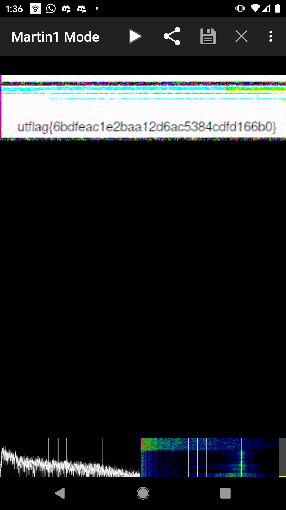

1 Frame Per Minute
=====

## Category: Forensics

> "I recently received this signal transmission known as SSTV in a mode called Martian? This technology is all very old so I'm not sure what to do with it. Could you help me out?"

## Methodology
FOr this challenge we were given a .wav file. By this time, I had already solved Spectre so I was fairly sure it wouldn't be a flag hidden in the spectrogram. After some research on SSTV, I found I could use an SSTV decoder to retreive the flag.

# Using Android
I downloaded an android app called robot36 to decode the signal. I opened signals.wav into audacity and set the project rate in the bottom left corner to 1Hz, and then I set the app up to listen to the signal and waited for the signal to be read in.

> utflag{6bdfeac1e2baa12d6ac5384cdfd166b0}
