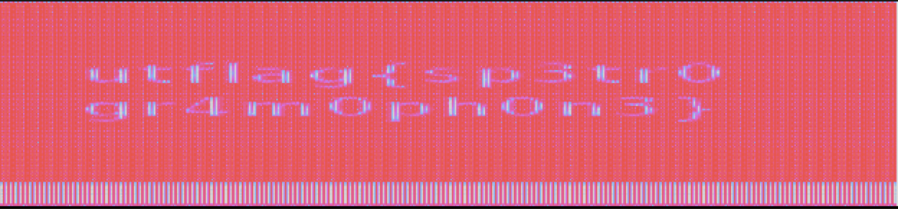

Spectre
=====
#### Solver: ap3xsh0t

## Category: Forensics

> "I found this audio file, but I don't think it's any song I've ever heard... Maybe there's something else inside?"

## Methodology
The big hint is in the name. I opened song.wav with audacity and switched to spectrogram view to retrieve the flag.

> utflag{sp3trogr4m0ph0n3}
