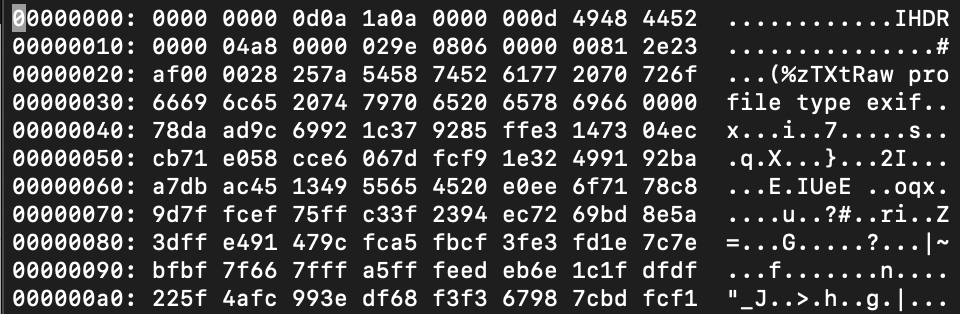

The Legend of Hackerman Pt. 1
=====
#### Solver: ap3xsh0t

## Category: Forensics

> "My friend Hackerman tried to send me a secret transmission, but I think some of it got messed up in transit. Can you fix it?"

## Methodology
We are given an image that appears to be corrupted. Looks like a standard missing magic bytes problem to me, so I open the image up in vim (because real hackers use vim) and then use xxd to edit the file.

> vim hackerman.png
>
>%!xxd

We can clearly see the magic bytes are missing. But how can we fix it? Since we have vim open using xxd, we can edit the bytes. After some quick research we see that we need to add the PNG signature of "0x89 0x50 0x4E 0x47 0x0D 0x0A 0x1A 0x0A", of which half of the bytes are already correct. Too easy. After editing the image, we exit from xxd and save the image.

> !%xxd -r
>
>:wq

> utflag{3lit3_h4ck3r}
