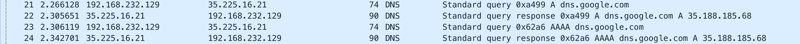
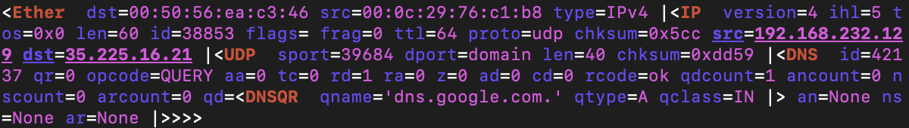
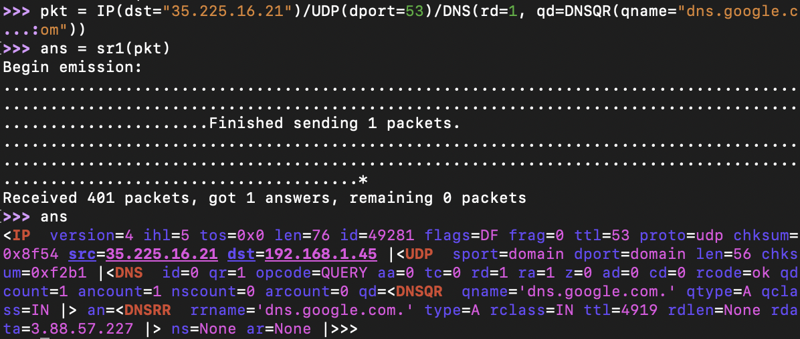
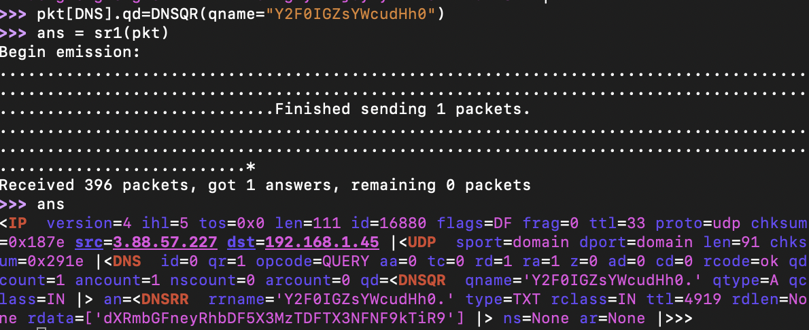

Do Not Stop
=====
#### Solver: ap3xsh0t

## Category: Networking

> "One of my servers was compromised, but I can't figure it out. See if you can solve it for me!"

## Methodology
First thing I did was open the PCAP up in wireshark to see any strange traffic. Everything looked relatively normal except for one thing: I spotted DNS traffic querying for a domain name that was base 64 encoded. I quickly decoded the string and found that the string was actually a command. The DNS reply also had base64 encoded traffic, which ended up being the output of the command.

> ls -la

> total 2512
>
> drwxr-xr-x    1 root     root          4096 Mar  6 04:44 .
>
> drwxr-xr-x    1 root     root          4096 Mar  6 08:09 ..
>
> -rw-r--r--    1 root     root         12288 Mar  6 04:42 .Makefile.swp
>
> -rw-r--r--    1 root     root           104 Mar  5 23:50 Dockerfile
>
> -rw-r--r--    1 root     root           119 Mar  5 23:50 Makefile
>
> -rw-r--r--    1 root     root            28 Mar  5 23:50 flag.txt
>
> -rwxr-xr-x    1 root     root       2533823 Mar  6 04:44 server
>
> -rw-r--r--    1 root     root          1693 Mar  5 23:50 server.go

So it appears as though commands were being issued across a network connection via DNS query. We can also see the location of flag.txt, which is what we are trying to retrieve. So naturally, I craft a scapy DNS packet to the same IP address as contained in the DNS query with the commands, base64 encode the command in the query field, and send it off, but it doesn't work.

### Finding the right IP address

At this point, it was back to the PCAP to see if I had missed something. I searched high and low and finally found reference of the IP address of the C2 channel. It appears the IP address has changed and we need to do a DNS query for dns.google.com to find our target machine.

### Crafting DNS queries with Scapy

The first thing I did was read in the pcap into scapy and print all of the fields of the query packet. This allows me to quickly see what fields I may need to set in my crafted query.

Next, I crafted my packet with the fields indicated in the image below. Once I sent the packet, I received a reply and found the IP address of the machine I need to communicate with to be 3.88.57.227.

### Retrieving the Flag

Now we are equipped with everything we need to retreive the flag. All we have to do is craft our packet to be sent to the server we found the IP address for. Repeating the steps above, we craft the packet with a qname of "Y2F0IGZsYWcudHh0", the base64 encoded representation of "cat flag.txt" and send the packet off.

> utflag{$al1y_s3L1S_sE4_dN$}
