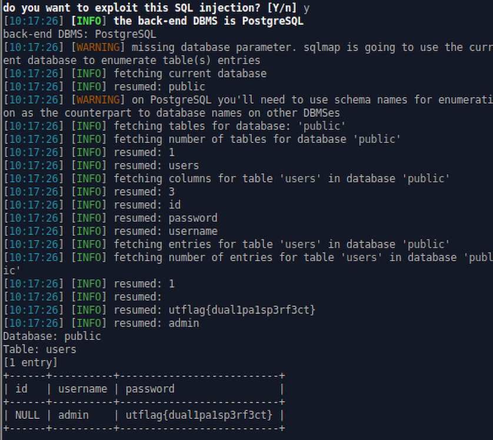

Epic Admin Pwn
=====

## Category: Web

> "this challenge is epic i promise. the flag is the password"

## Methodology
The webpage opens with a login page as seen below:

At first glance this appears to be a SQL Injection attack, however, none of the standard SQL injection attacks that I knew off the top of my head worked. Since I have limited exposure to conducting SQL injection attacks, I opted to use sqlmap. 

> ./sqlmap.py  -u "http://web2.utctf.live:5006/" --forms --dump

Sure enough, sqlmap was able to dump the database in our laps, revealing the flag. From what I can understand, the attack without sqlmap would have required blind conditional response SQL-I.

> utflag{dual1pa1sp3rf3ct} 
